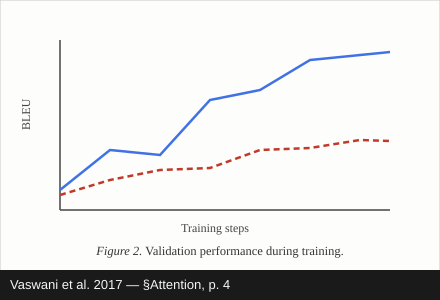
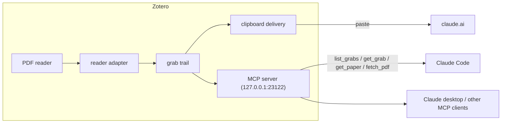
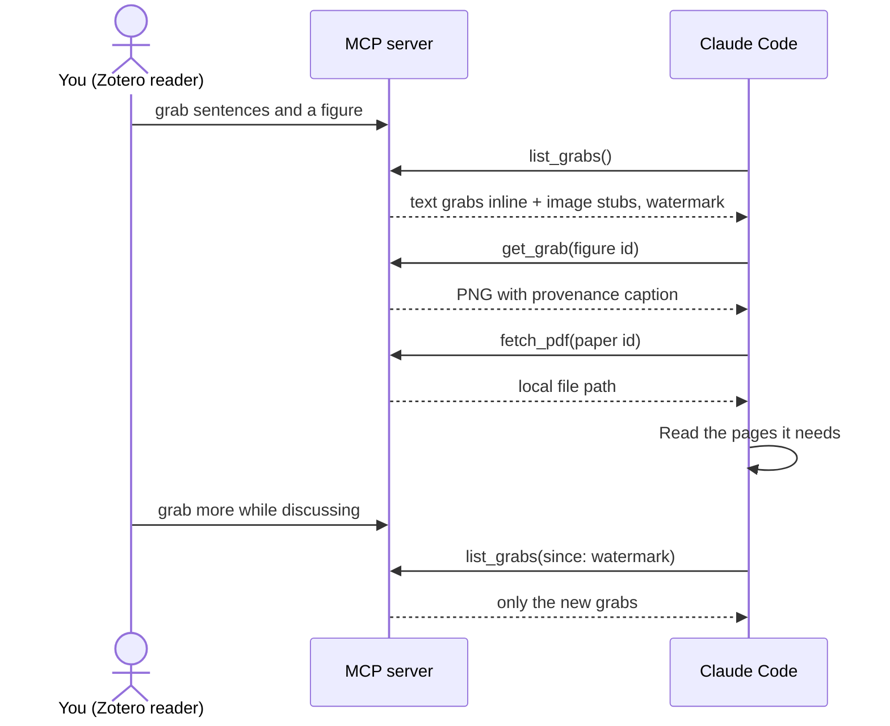

# Zotero Context

[![repo status][repostatus-badge]][repostatus-site]
[![zotero target version][zotero-badge]][zotero-site]
[![Using Zotero Plugin Template][template-badge]][template-repo]
![ci][ci-badge]

A [Zotero][zotero-site] plugin to ferry context for active readers.

When reading a paper and chatting with an AI (claude.ai, Claude Desktop, ChatGPT, ...),
getting context into the chat is arduous:
precisely selecting text, positioning screenshot boxes, remembering section and figure numbers,
and downloading/uploading/introducing the PDF itself.
Zotero Context turns each of those into a click or a hotkey.

Unlike plugins that embed an AI chat inside Zotero,
this plugin has no chat UI, no API keys, and no model calls.
It ferries context to whichever chat you already use:
push it via the clipboard, or let MCP-capable chats
(Claude Code, Claude desktop, OpenAI's Codex CLI, ...) pull it themselves.

## Features

Everything revolves around **grab mode** in the PDF reader: click the
 button
in the reader toolbar (or press the grab hotkey),
and the cursor becomes a crosshair.

Hotkeys are quote-key **leader sequences**:
tap the leader (`Ctrl+'` on Windows/Linux, `Cmd+'` on macOS), then a mnemonic letter;
grabs paste as quotes, so every action starts with the quote key.
Why this scheme (and not `Ctrl+Alt+…` or `Shift+…`): [DESIGN.md](DESIGN.md).

- **Sentence snap**: hover text and the sentence under the cursor glows;
  click to copy it as quoted text.
  `Shift`-click a later sentence to extend the grab through a range.
  No drag-selection needed.
- **Two-click area grab**: click two opposite corners of a figure, table, or formula
  to copy that region as an image. `Esc` cancels a pending corner.
- **Provenance on every grab**: the first grab from a paper carries its full citation;
  later grabs carry a compact locator
  (section names come from the PDF outline, embedded or Zotero-generated,
  with page-only fallback).
  A first and a second text grab paste as:

  ```text
  From "Attention Is All You Need" (Vaswani et al. 2017), §Encoder and Decoder Stacks, p. 3:
  > Encoder: The encoder is composed of a stack of N = 6 identical layers. ...

  §Attention, p. 4:
  > An attention function can be described as mapping a query and a set of key-value pairs ...
  ```

  Image grabs carry the same provenance as a caption strip rendered into the image itself,
  since chat inputs take only the image from a mixed paste. A grabbed figure arrives as:

  

- **Session bundle**: grabs accumulate in an in-memory trail.
  The leader then `B` copies everything since your last bundle as one text block
  (image grabs cycle onto the clipboard with repeated presses);
  `R` copies a full-session recap for seeding a fresh chat;
  `X` clears the trail.
- **Paper intro**: the leader then `I` puts the paper's PDF file on the clipboard;
  pasting into claude.ai attaches it.
  Press again within a minute for an intro message (citation + abstract) to open the chat with.
- **Scanned PDFs**: sentence snap degrades to per-line snap targets automatically.
  Detection is character-exact: the plugin aligns the extracted sentence text against the
  PDF's glyph geometry unit by unit (absorbing ligatures and dehyphenated line breaks),
  and when the two can't be reconciled (typical for OCR'd text layers),
  it distrusts sentence boundaries and offers visual lines instead,
  which are derived from glyph positions alone.

### Hotkeys

Every sequence is two presses in a row, never three keys held at once:
first the two-key leader chord (hold `Ctrl` and tap `'`; on macOS, `Cmd` and `'`),
then tap the letter within 2 seconds.
Keeping `Ctrl`/`Cmd` held down through the letter also works;
`Esc` cancels an armed leader.

| Windows/Linux   | macOS          | Action                                            |
| --------------- | -------------- | ------------------------------------------------- |
| `Ctrl+' G` or ⌖ | `Cmd+' G` or ⌖ | Toggle grab mode in the focused reader tab        |
| Click           | Click          | Grab hovered sentence (or place an area corner)   |
| `Shift`+click   | same           | Extend the text grab through the clicked sentence |
| `Esc`           | same           | Cancel pending corner, then exit grab mode        |
| `Ctrl+' B`      | `Cmd+' B`      | Copy bundle of grabs since last bundle            |
| `Ctrl+' R`      | `Cmd+' R`      | Copy full-session recap                           |
| `Ctrl+' X`      | `Cmd+' X`      | Clear the session trail                           |
| `Ctrl+' I`      | `Cmd+' I`      | Copy paper PDF; press again for the intro message |

## MCP server (pull delivery)

The clipboard pushes grabs into a chat; the MCP server lets the chat **pull** them.
Grabs are deliberately lean pointers — a quote or a cropped figure plus a locator —
so the moment a conversation needs more than what you grabbed
("how does this relate to their ablation study?"),
the model can fetch the surrounding context itself:
list your grab trail, pull a figure's pixels, or read the paper's whole PDF from disk,
with no download/upload dance.
This works for MCP clients that can reach your machine — Claude Code, Claude desktop,
OpenAI's Codex CLI, and similar; browser-based chats such as claude.ai cannot connect
to localhost servers, so they use the clipboard flow
(a zero-paste browser extension is the planned v0.2).



A typical pull loop, after you grab a few passages and say
_"take a look at what I've been reading"_:



### Tools

| Tool         | Returns                                                                                                          |
| ------------ | ---------------------------------------------------------------------------------------------------------------- |
| `list_grabs` | The grab trail: text grabs inline, image grabs as stubs; filter by paper or by `since` watermark for delta pulls |
| `get_grab`   | One grab's full payload (images as PNG content)                                                                  |
| `get_paper`  | Metadata + abstract for a paper in the trail                                                                     |
| `fetch_pdf`  | The paper's PDF as a local file path (+ size) for the client to read directly                                    |

Papers are identified by the grab trail, never by which reader tab has focus —
and the server can only serve papers you have grabbed from this session.

### Setup

The MCP server is **off by default**. Two steps:

1. In Zotero: Settings → Zotero Context → enable **MCP server**.
   The status line should read "Running on 127.0.0.1:23122".
2. Click **Copy Claude Code command** and run it in a terminal — it looks like:

   ```sh
   claude mcp add --transport http zotero-context http://127.0.0.1:23122/mcp \
     --header "Authorization: Bearer <your minted token>"
   ```

   For Claude desktop — or any GUI MCP client that reads `mcpServers` JSON,
   such as Cursor — click **Copy MCP config (JSON)** instead and merge it into
   the client's config file (`claude_desktop_config.json` for Claude desktop).

Why port 23122: it continues the de facto Zotero port block — 23119 is Zotero's own
connector server and 23120 is [zotero-mcp][zotero-mcp]'s — while skipping 23121, which
several AI-bridge plugins already bind
([zotero-filelink-bridge][filelink-bridge], [zotero-notebooklm][notebooklm],
[aiops-lmstudio-zotero-plugin][lmstudio-bridge]).
The port is a setting in the same pane if 23122 is taken on your machine.

Troubleshooting:

- **Status says the port is in use**: another app owns the port — change it in
  the same pane (the copy buttons regenerate commands with the new port).
- **401s after an update**: some clients drop configured headers; click
  **Copy token** and re-add the header manually.
- **Windows Zotero + WSL chat client**: `fetch_pdf` returns Windows paths
  (`C:\...`) that WSL processes must translate (`/mnt/c/...`); untested.

### Security

Off by default; binds `127.0.0.1` only with `Host`/`Origin` rejection
(DNS-rebinding defense); a bearer token on every request; retrieval scoped to
papers grabbed this session — in the spirit of the
[MCP transport security guidance][mcp-security].
Project-wide security model, data flows, and accepted risks: [SECURITY.md](SECURITY.md).

## Limitations (current)

- Grabs are ephemeral: nothing is written to your library, and the trail resets with Zotero.
- Hotkeys are fixed for now; preferences for bindings and press-and-hold are planned.
  Sequences match physical key positions,
  so on non-US layouts the leader is "the key right of `L`" whatever it's labeled (`Ä` on QWERTZ, `ù` on AZERTY);
  see [DESIGN.md](DESIGN.md) for the full shortcut rationale.
- Element-picking (click a figure to auto-bound it) is on the roadmap;
  see `openspec/changes/add-context-ferry/` for the full plan.

## Installation

- Encouraged: install in-app via the [Zotero Addons][zotero-addons] plugin marketplace
- Manual:
  1. Download the latest `.xpi` from [this repo's GitHub Releases][releases]
  2. install it via Zotero's Tools → Plugins menu

## Development

See [CONTRIBUTING.md](CONTRIBUTING.md).

## License

[AGPL-3.0-or-later](LICENSE).
Built from [zotero-plugin-template][template-repo].

[ci-badge]: https://github.com/jamesbraza/zotero-context/actions/workflows/ci.yml/badge.svg
[releases]: https://github.com/jamesbraza/zotero-context/releases
[repostatus-badge]: https://www.repostatus.org/badges/latest/wip.svg
[repostatus-site]: https://www.repostatus.org/#wip
[filelink-bridge]: https://github.com/ImagonTuTu/zotero-filelink-bridge
[lmstudio-bridge]: https://github.com/sachajw/aiops-lmstudio-zotero-plugin
[mcp-security]: https://modelcontextprotocol.io/specification/2025-06-18/basic/transports#security-warning
[notebooklm]: https://github.com/iuliaturc/zotero-notebooklm
[zotero-mcp]: https://github.com/cookjohn/zotero-mcp
[template-badge]: https://img.shields.io/badge/Using-Zotero%20Plugin%20Template-blue?style=flat-square&logo=github
[template-repo]: https://github.com/windingwind/zotero-plugin-template
[zotero-addons]: https://github.com/syt2/zotero-addons
[zotero-badge]: https://img.shields.io/badge/Zotero-9-green?style=flat-square&logo=zotero&logoColor=CC2936
[zotero-site]: https://www.zotero.org
